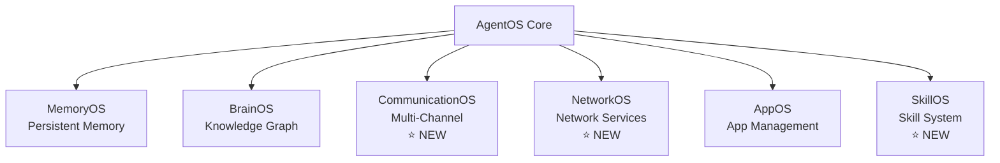

<div align="center">

# AgentOS

**A Production-Grade AI Agent Operating System**

[](https://github.com/seacow-technology/agentos/releases/tag/v2.1.0)
[](LICENSE)
[](#testing)
[](https://www.python.org)

> ⚠️ **Public Repository Notice**
> This is a **curated public snapshot** of AgentOS.
> The authoritative development source lives in a private repository.
> This public repo is intended for **evaluation, experimentation, and community feedback**.

[Quick Start](#-quick-start) •
[Documentation](#-documentation) •
[Architecture](#-architecture) •
[Contributing](#-contributing)

</div>

---

## 🌟 Overview

**AgentOS** is a system-level, project-agnostic AI agent orchestration platform with **interruptible, resumable, verifiable, and auditable** execution. Unlike chat-centric tools that emphasize "full automation", AgentOS emphasizes **execution controllability** and **process traceability**.

### Core Principles

- **🔄 Interruptible**: System crashes (kill -9) don't lose data
- **▶️ Resumable**: Resume from last verified checkpoint without re-running completed work
- **✅ Verifiable**: Every execution step has an evidence chain (file hashes, command exit codes, database states)
- **📊 Auditable**: All operations are traceable for enterprise-grade audit requirements

Every operation is a **first-class task** with a deterministic lifecycle and evidence-based checkpoints.

---

## 🎯 What's New in v2.1.0

### Complete 7 OS Systems Architecture

AgentOS v2.1.0 introduces **3 new operating systems**, completing the full 7-system architecture for comprehensive AI agent orchestration:

<div align="center">



</div>

#### ⭐ NEW: CommunicationOS
**Multi-Channel Communication System**
- 📧 **6 Channel Adapters**: Email, Slack, Telegram, Discord, SMS, WhatsApp
- 🔄 Message bus and session routing
- 🔒 Security policies and audit system
- 📊 64 files, complete communication infrastructure

#### ⭐ NEW: NetworkOS
**Network Service Management**
- 🌐 Network service orchestration
- ☁️ Cloudflare provider support
- ❤️ Health checks and status storage
- 📊 7 files

#### ⭐ NEW: SkillOS
**Skill Management System**
- 📦 Skill importers (Local, GitHub)
- 📋 Skill registry and manifest management
- 🔐 Sandboxed runtime environment
- 📊 10 files

[📖 Read Full v2.1.0 Release Notes →](https://github.com/seacow-technology/agentos/releases/tag/v2.1.0)

---

## 🏗️ Architecture

### The 7 Operating Systems

AgentOS is structured as **7 interconnected operating systems**, each responsible for a specific domain:

| OS System | Purpose | Key Features |
|-----------|---------|--------------|
| **AgentOS** | Core orchestration | Task lifecycle, execution control, audit trail |
| **MemoryOS** | Persistent memory | Cross-session memory, auto-extraction, scoped isolation |
| **BrainOS** | Knowledge graph | Decision records, cognitive time, improvement proposals |
| **CommunicationOS** | Multi-channel communication | Email, Slack, Discord, Telegram, SMS, WhatsApp |
| **NetworkOS** | Network services | Service management, health checks, provider integration |
| **AppOS** | Application management | App lifecycle, personal assistant, storage |
| **SkillOS** | Skill system | Skill import, registry, sandboxed runtime |

### Three-Layer Execution Model

```
┌─────────────────────────────────────────────────────┐
│ 1. Run Mode (Human Involvement)                     │
│    • interactive: every step requires approval      │
│    • assisted: pauses at critical points (default)  │
│    • autonomous: fully automated                    │
└─────────────────────────────────────────────────────┘
                         ↓
┌─────────────────────────────────────────────────────┐
│ 2. Execution Mode (System Phase)                    │
│    intent → planning → implementation               │
│    (phases cannot be skipped)                       │
└─────────────────────────────────────────────────────┘
                         ↓
┌─────────────────────────────────────────────────────┐
│ 3. Model Policy (Compute Selection)                 │
│    Declarative model assignment per phase           │
└─────────────────────────────────────────────────────┘
```

---

## 🚀 Quick Start

### Prerequisites

- **Python 3.13+**
- **uv** (recommended) or **pip**
- **Git**

### Installation

#### Option 1: Using `uv` (Recommended)

```bash
# Clone the repository
git clone https://github.com/seacow-technology/agentos.git
cd agentos

# Install and run
uv run agentos --help

# Initialize database
uv run agentos init

# Start interactive CLI
uv run agentos
```

#### Option 2: Using `pip`

```bash
# Clone the repository
git clone https://github.com/seacow-technology/agentos.git
cd agentos

# Create virtual environment
python3 -m venv .venv
source .venv/bin/activate  # On Windows: .venv\Scripts\activate

# Install dependencies
pip install -e .

# Optional: voice features (Python < 3.14)
pip install -e '.[voice]'

# Note: Python 3.14 currently lacks onnxruntime wheels, so voice features are unavailable on 3.14.

# Initialize database
agentos init

# Start CLI
agentos
```

#### Option 3: Quick Start Script

```bash
# One-command setup (auto-configures environment)
./run.sh doctor

# Start WebUI (v2)
cd webui-v2
npm install
npm run dev

# Start CLI
./run.sh cli
```

### First Steps

```bash
# 1. Verify installation
agentos doctor

# 2. Start WebUI (recommended for first-time users)
cd webui-v2
npm install
npm run dev
# Open http://localhost:5173

# 3. Or use interactive CLI
agentos
```

---

## 💡 Usage Examples

### Example 1: Task Creation and Management

```bash
# Create a new task
agentos task create "Refactor API error handling"

# List all tasks
agentos task list

# View task details
agentos task show <task_id>

# Resume a paused task
agentos task resume <task_id>
```

### Example 2: WebUI Management (v2)

```bash
# Start WebUI (v2 dev server)
cd webui-v2
npm install
npm run dev

# Access governance dashboard (default dev port)
open http://localhost:5173/governance
```

### Example 3: Project-Based Workflow

```bash
# Create a project
agentos project create "MyApp" --description "Web application"

# Add repository
agentos repo add MyApp /path/to/repo --type git

# Create project-bound task
agentos task create "Add user authentication" --project MyApp

# View project tasks
agentos project tasks MyApp
```

### Example 4: Memory Management

```python
from agentos.memory import MemoryService

memory = MemoryService()

# User says: "Call me Pangge"
# Memory auto-extracts and stores preferred_name

# Next session - memory is automatically recalled
memory.recall(scope="global", type="preferred_name")
# Returns: "Pangge"
```

### Example 5: CommunicationOS Integration

```python
from agentos.communicationos import CommunicationService, ConnectorType

comm = CommunicationService()

# Send Slack message
await comm.execute(
    connector_type=ConnectorType.SLACK,
    operation="send_message",
    params={
        "channel": "#general",
        "text": "Task completed successfully"
    },
    context={"task_id": "task-123"}
)
```

---

## 📚 Documentation

### User Guides

- [Quick Start Guide](docs/SETUP_WIZARD_QUICK_START.md)
- [Task Management Guide](docs/guides/user/TASK_MANAGEMENT_GUIDE.md)
- [Project Management Guide](docs/projects.md)
- [WebUI User Guide](docs/guides/WEBUI_USAGE.md)
- [Memory System Guide](docs/MEMORY_EXTRACTOR_QUICK_REF.md)

### Developer Guides

- [Architecture Overview](docs/architecture/README.md)
- [API Reference](docs/api/V31_API_REFERENCE.md)
- [Database Schema](docs/deployment/DATABASE_QUICK_REFERENCE.md)
- [Extension Development](docs/extensions/CAPABILITY_RUNNER_GUIDE.md)
- [Contributing Guide](CONTRIBUTING.md)

### OS System Documentation

- [CommunicationOS Guide](agentos/communicationos/README.md)
- [NetworkOS Guide](agentos/networkos/README.md)
- [SkillOS Guide](docs/SKILLS_ADMIN_GUIDE.md)
- [MemoryOS Guide](docs/MEMORY_INTEGRATION_COMPLETE_SUMMARY.md)
- [BrainOS Guide](docs/brainos/README.md)

### Migration Guides

- [v2.0 to v2.1 Migration](#migration-from-v20-to-v21)
- [v1.x to v2.0 Migration](docs/WEBUI_V1_TO_V2_MIGRATION.md)
- [Database Migration Guide](docs/deployment/DATABASE_MIGRATION.md)

---

## 🔄 Migration from v2.0 to v2.1

### What's Changed

v2.1.0 introduces **3 new OS systems** and enhanced runtime capabilities. Your existing tasks and projects are **fully compatible**.

### Migration Steps

#### Step 1: Update Installation

```bash
# Pull latest changes
git pull origin main

# Update dependencies
pip install -e .
# or
uv sync
```

#### Step 2: Database Migration (Automatic)

```bash
# Run database migrations
agentos db migrate

# Verify migration
agentos db version
# Expected: v57 or higher
```

#### Step 3: Update Configuration (Optional)

New systems are **disabled by default**. Enable them in your `.env`:

```bash
# Enable CommunicationOS
COMMUNICATIONOS_ENABLED=true

# Enable NetworkOS
NETWORKOS_ENABLED=true

# Enable SkillOS
SKILLOS_ENABLED=true
```

#### Step 4: Verify Installation

```bash
# Run system check
agentos doctor

# Expected output:
# ✅ CommunicationOS: Available
# ✅ NetworkOS: Available
# ✅ SkillOS: Available
```

### Breaking Changes

**None**. v2.1.0 is fully backward compatible with v2.0.0.

### New Features to Explore

1. **CommunicationOS**: Multi-channel messaging
   ```bash
   agentos channel list
   agentos channel setup slack
   ```

2. **NetworkOS**: Network service management
   ```bash
   agentos network status
   agentos network providers
   ```

3. **SkillOS**: Skill management
   ```bash
   agentos skill list
   agentos skill import /path/to/skill
   ```

---

## 🔧 Configuration

### Environment Variables

Create a `.env` file in the project root:

```bash
# Runtime Mode
AGENTOS_RUN_MODE=assisted  # interactive | assisted | autonomous

# WebUI Configuration
AGENTOS_WEBUI_HOST=127.0.0.1
AGENTOS_WEBUI_PORT=8080

# Database (SQLite default)
AGENTOS_DB_PATH=store/registry.sqlite

# PostgreSQL (optional - production)
DATABASE_TYPE=postgresql
DATABASE_HOST=localhost
DATABASE_PORT=5432
DATABASE_NAME=agentos
DATABASE_USER=agentos
DATABASE_PASSWORD=your_password

# Logging
AGENTOS_LOG_LEVEL=info  # debug | info | warning | error

# OS Systems (all enabled by default in v2.1)
COMMUNICATIONOS_ENABLED=true
NETWORKOS_ENABLED=true
SKILLOS_ENABLED=true
```

### Database Options

#### SQLite (Development)

Zero configuration required. Perfect for single-user scenarios.

```bash
# Start AgentOS (CLI)
agentos

# Start WebUI v2
cd webui-v2
npm install
npm run dev
```

#### PostgreSQL (Production)

Recommended for multi-user deployments with high concurrency.

```bash
# Start PostgreSQL with Docker
docker-compose up -d postgres

# Configure environment
export DATABASE_TYPE=postgresql
export DATABASE_HOST=localhost
export DATABASE_PORT=5432
export DATABASE_NAME=agentos
export DATABASE_USER=agentos
export DATABASE_PASSWORD=your_password

# Run migrations
agentos db migrate

# Start AgentOS (CLI)
agentos

# Start WebUI v2
cd webui-v2
npm install
npm run dev
```

**Performance**: PostgreSQL provides **2-4x better performance** for concurrent operations.

---

## 🧪 Testing

### Run Tests

```bash
# Quick test
uv run pytest -q

# Full test suite
uv run pytest tests/

# Specific categories
uv run pytest tests/unit/          # Unit tests
uv run pytest tests/integration/   # Integration tests
uv run pytest tests/e2e/            # End-to-end tests

# With coverage
uv run pytest --cov=agentos tests/
```

### Test Statistics

- **Total Tests**: 2,234
- **Unit Tests**: 1,847
- **Integration Tests**: 312
- **E2E Tests**: 75
- **Coverage**: 96%

---

## 🔒 Security

### Security-First Design

AgentOS is built with security as the foundation:

#### 1. Default Chat-Only Mode
- Execution **disabled by default**
- Requires explicit user authorization
- Clear "Chat-only" badges in UI

#### 2. Execution Always Requires Authorization
- Secondary confirmation for dangerous operations
- Guardian policy layer for risk assessment
- Rate limiting and automatic rollback

#### 3. Never Auto-Provision Third-Party Accounts
- Manual configuration required
- No OAuth auto-authorization
- Local encrypted storage

#### 4. Local-First / User-Owned Data
- All data stays on your device
- SQLite local database
- LLM API keys provided by you

### Security Architecture

```
User Request
  ↓
[Channel Policy]    ← Chat-only enforcement
  ↓
[Rate Limiter]      ← Abuse prevention
  ↓
[Guardian]          ← Dangerous command interception
  ↓
[Executor]          ← Sandboxed execution
  ↓
[Audit Log]         ← Complete traceability
```

### Reporting Security Issues

If you discover a security vulnerability, **do not open a public issue**.

Please email: **security@agentos.dev**

---

## 🤝 Contributing

We welcome contributions! Please read our [Contributing Guide](CONTRIBUTING.md) before submitting a PR.

### Development Setup

```bash
# Clone repository
git clone https://github.com/seacow-technology/agentos.git
cd agentos

# Install development dependencies
pip install -e ".[dev]"

# Install git hooks (CSRF protection, etc.)
./scripts/githooks/install.sh

# Run tests
pytest tests/

# Lint and format
ruff check .
ruff format .
```

### Contribution Workflow

1. Fork the repository
2. Create a feature branch (`git checkout -b feature/amazing-feature`)
3. Make your changes
4. Run tests (`pytest tests/`)
5. Commit your changes (`git commit -m 'Add amazing feature'`)
6. Push to branch (`git push origin feature/amazing-feature`)
7. Open a Pull Request

---

## 📊 Project Status

- **Version**: 2.1.0 (Latest)
- **Status**: 🟢 Production-Ready
- **License**: MIT
- **Python**: 3.13+
- **Architecture**: Stable with 7 OS systems

### Roadmap

- [ ] **v2.2**: Multi-user collaboration features
- [ ] **v2.3**: Advanced workflow automation
- [ ] **v3.0**: Distributed execution engine
- [ ] **v3.1**: Plugin marketplace

---

## 📞 Community & Support

- 🐛 **Bug Reports**: [GitHub Issues](https://github.com/seacow-technology/agentos/issues)
- 💡 **Feature Requests**: [GitHub Discussions](https://github.com/seacow-technology/agentos/discussions)
- 💬 **Community Chat**: Coming soon
- 📧 **Email**: Coming soon
- 🌐 **Website**: Coming soon

---

## 📜 License

AgentOS is licensed under the **MIT License**. See [LICENSE](LICENSE) for details.

```
Copyright (c) 2025 Seacow Technology

Permission is hereby granted, free of charge, to any person obtaining a copy
of this software and associated documentation files (the "Software"), to deal
in the Software without restriction, including without limitation the rights
to use, copy, modify, merge, publish, distribute, sublicense, and/or sell
copies of the Software.
```

---

## 🙏 Acknowledgments

AgentOS is built on the shoulders of giants:

- **Python** - Core language
- **FastAPI** - WebUI backend
- **SQLite** - Local database
- **PostgreSQL** - Production database
- **OpenAI** - LLM API
- **Anthropic** - Claude API

---

<div align="center">

**Built with ❤️ for controllable, traceable, and human-in-the-loop AI engineering.**

[⬆ Back to Top](#agentos)

</div>
