<div align="center">

# OctopusOS

**A Production-Grade AI Agent Operating System**

[](https://github.com/seacow-technology/octopusos/releases/tag/v2.1.0)
[](LICENSE)
[](#testing)
[](https://www.python.org)

> ⚠️ **Public Repository Notice**
> This is a **curated public snapshot** of OctopusOS.
> The authoritative development source lives in a private repository.
> This public repo is intended for **evaluation, experimentation, and community feedback**.

[Quick Start](#-quick-start) •
[Documentation](#-documentation) •
[Architecture](#-architecture) •
[Contributing](#-contributing)

</div>

---

## 🌟 Overview

**OctopusOS** is a system-level, project-agnostic AI agent orchestration platform with **interruptible, resumable, verifiable, and auditable** execution. Unlike chat-centric tools that emphasize "full automation", OctopusOS emphasizes **execution controllability** and **process traceability**.

### Core Principles

- **🔄 Interruptible**: System crashes (kill -9) don't lose data
- **▶️ Resumable**: Resume from last verified checkpoint without re-running completed work
- **✅ Verifiable**: Every execution step has an evidence chain (file hashes, command exit codes, database states)
- **📊 Auditable**: All operations are traceable for enterprise-grade audit requirements

Every operation is a **first-class task** with a deterministic lifecycle and evidence-based checkpoints.

---

## 🎯 What's New in v2.1.0

### Complete 7 OS Systems Architecture

OctopusOS v2.1.0 introduces **3 new operating systems**, completing the full 7-system architecture for comprehensive AI agent orchestration:

```mermaid
graph TB
    A[OctopusOS Core] --> B[MemoryOS]
    A --> C[BrainOS]
    A --> D[CommunicationOS]
    A --> E[NetworkOS]
    A --> F[AppOS]
    A --> G[SkillOS]

    B[MemoryOS<br/>Persistent Memory]
    C[BrainOS<br/>Knowledge Graph]
    D[CommunicationOS<br/>Multi-Channel<br/>⭐ NEW]
    E[NetworkOS<br/>Network Services<br/>⭐ NEW]
    F[AppOS<br/>App Management]
    G[SkillOS<br/>Skill System<br/>⭐ NEW]
```

<div align="center">



</div>

#### ⭐ NEW: CommunicationOS
**Multi-Channel Communication System**
- 📧 **6 Channel Adapters**: Email, Slack, Telegram, Discord, SMS, WhatsApp
- 🔄 Message bus and session routing
- 🔒 Security policies and audit system
- 📊 64 files, complete communication infrastructure

##### BridgeOS Compatibility Matrix Template (English)

Use this template when onboarding any new bridge-based IM channel.

| Field | Description | Example |
|---|---|---|
| `channel_id` | Stable channel identifier in CommunicationOS | `line` |
| `bridge_profile_id` | BridgeOS profile id bound to the channel | `f8a6f8d1-...` |
| `bridge_base_url` | Bridge endpoint base URL (stored in BridgeOS profile) | `http://127.0.0.1:17002` |
| `send_path` | Outbound bridge send API path | `/api/im/send` |
| `inbound_webhook_path` | OctopusOS inbound webhook path | `/api/channels/line/webhook` |
| `webhook_auth` | Accepted auth mechanism | `X-Bridge-Token` or `Authorization: Bearer` |
| `session_scope` | Session keying strategy | `user_conversation` |
| `inbound_fields` | Required inbound mapping fields | `message_id`, `text`, `conversation_key`, `user_key` |
| `outbound_fields` | Required outbound payload fields | `to`, `text`, `channel_id`, `session_id` |
| `capabilities` | Declared channel capabilities | `inbound_text`, `outbound_text`, `threaded_conversations` |
| `policy_defaults` | Security defaults | `chat_only`, `allow_execute=false`, `rate_limit_per_minute=30` |
| `network_exposure` | External proxy strategy | `NetworkOS + Cloudflare capability request` |
| `risk_tier` | Integration risk tier for governance | `A` / `B` / `C` |
| `compliance_notes` | Data residency, retention, consent notes | `region-bound storage; token encrypted` |

#### ⭐ NEW: NetworkOS
**Network Service Management**
- 🌐 Network service orchestration
- ☁️ Cloudflare provider support
- ❤️ Health checks and status storage
- 📊 7 files

#### ⭐ NEW: SkillOS
**Skill Management System**
- 📦 Skill importers (Local, GitHub)
- 📋 Skill registry and manifest management
- 🔐 Sandboxed runtime environment
- 📊 10 files

[📖 Read Full v2.1.0 Release Notes →](https://github.com/seacow-technology/octopusos/releases/tag/v2.1.0)

---

## 🏗️ Architecture

### The 7 Operating Systems

OctopusOS is structured as **7 interconnected operating systems**, each responsible for a specific domain:

| OS System | Purpose | Key Features |
|-----------|---------|--------------|
| **OctopusOS** | Core orchestration | Task lifecycle, execution control, audit trail |
| **MemoryOS** | Persistent memory | Cross-session memory, auto-extraction, scoped isolation |
| **BrainOS** | Knowledge graph | Decision records, cognitive time, improvement proposals |
| **CommunicationOS** | Multi-channel communication | Email, Slack, Discord, Telegram, SMS, WhatsApp |
| **NetworkOS** | Network services | Service management, health checks, provider integration |
| **AppOS** | Application management | App lifecycle, personal assistant, storage |
| **SkillOS** | Skill system | Skill import, registry, sandboxed runtime |

### Three-Layer Execution Model

```
┌─────────────────────────────────────────────────────┐
│ 1. Run Mode (Human Involvement)                     │
│    • interactive: every step requires approval      │
│    • assisted: pauses at critical points (default)  │
│    • autonomous: fully automated                    │
└─────────────────────────────────────────────────────┘
                         ↓
┌─────────────────────────────────────────────────────┐
│ 2. Execution Mode (System Phase)                    │
│    intent → planning → implementation               │
│    (phases cannot be skipped)                       │
└─────────────────────────────────────────────────────┘
                         ↓
┌─────────────────────────────────────────────────────┐
│ 3. Model Policy (Compute Selection)                 │
│    Declarative model assignment per phase           │
└─────────────────────────────────────────────────────┘
```

---

## 🚀 Quick Start

### Prerequisites

- **Python 3.13+**
- **uv** (recommended) or **pip**
- **Git**

### Installation

#### Windows (GA Installer)

1. Download the latest Windows MSI from [Releases](https://github.com/seacow-technology/octopusos/releases).
2. Install the MSI.
3. Open a new PowerShell and run:

```powershell
octopusos webui start
octopusos webui status
octopusos logs --tail --lines 50
octopusos webui stop
```

#### macOS / Linux (Developer Setup for now)

Packaged installer distribution for macOS/Linux is planned. Use developer setup currently.

```bash
# Clone the repository
git clone https://github.com/seacow-technology/octopusos.git
cd octopusos

# Create virtual environment
python3 -m venv .venv
source .venv/bin/activate  # On Windows: .venv\Scripts\activate

# Install editable package
pip install -e .

# Optional: voice features (Python < 3.14)
pip install -e '.[voice]'

# Verify and start daemon-managed WebUI
octopusos doctor
export OCTOPUSOS_ADMIN_TOKEN='your-token'  # Recommended: enable protected write operations in WebUI
octopusos webui start
octopusos webui status
octopusos logs --tail --lines 50

# Stop WebUI
octopusos webui stop
```

#### Developer Setup (Source Workflow)

```bash
# One-command local setup helper
./run.sh doctor
./run.sh cli
```

### First Steps

```bash
# 1. Verify installation
octopusos doctor

# 2. Configure Admin Token (recommended for write operations)
export OCTOPUSOS_ADMIN_TOKEN='your-token'

# 3. Start daemon-managed WebUI
octopusos webui start
octopusos webui status

# 4. Or use interactive CLI
octopusos
```

---

## 💡 Usage Examples

### Example 1: Task Creation and Management

```bash
# Create a new task
octopusos task create "Refactor API error handling"

# List all tasks
octopusos task list

# View task details
octopusos task show <task_id>

# Resume a paused task
octopusos task resume <task_id>
```

### Example 2: WebUI Management (Daemon)

```bash
# Start daemon in background
octopusos webui start

# Check state and URL
octopusos webui status

# Tail runtime logs
octopusos logs --tail --lines 50

# Restart or stop
octopusos webui restart
octopusos webui stop
```

### Example 3: Project-Based Workflow

```bash
# Create a project
octopusos project create "MyApp" --description "Web application"

# Add repository
octopusos repo add MyApp /path/to/repo --type git

# Create project-bound task
octopusos task create "Add user authentication" --project MyApp

# View project tasks
octopusos project tasks MyApp
```

### Example 4: Memory Management

```python
from octopusos.memory import MemoryService

memory = MemoryService()

# User says: "Call me Pangge"
# Memory auto-extracts and stores preferred_name

# Next session - memory is automatically recalled
memory.recall(scope="global", type="preferred_name")
# Returns: "Pangge"
```

### Example 5: CommunicationOS Integration

```python
from octopusos.communicationos import CommunicationService, ConnectorType

comm = CommunicationService()

# Send Slack message
await comm.execute(
    connector_type=ConnectorType.SLACK,
    operation="send_message",
    params={
        "channel": "#general",
        "text": "Task completed successfully"
    },
    context={"task_id": "task-123"}
)
```

---

## 📚 Documentation

### User Guides

- [Quick Start Guide](docs/SETUP_WIZARD_QUICK_START.md)
- [Task Management Guide](docs/guides/user/TASK_MANAGEMENT_GUIDE.md)
- [Project Management Guide](docs/projects.md)
- [WebUI User Guide](docs/guides/WEBUI_USAGE.md)
- [Memory System Guide](docs/MEMORY_EXTRACTOR_QUICK_REF.md)

### Developer Guides

- [Architecture Overview](docs/architecture/README.md)
- [API Reference](docs/api/V31_API_REFERENCE.md)
- [Database Schema](docs/deployment/DATABASE_QUICK_REFERENCE.md)
- [Extension Development](docs/extensions/CAPABILITY_RUNNER_GUIDE.md)
- [Contributing Guide](CONTRIBUTING.md)

### OS System Documentation

- [CommunicationOS Guide](octopusos/communicationos/README.md)
- [NetworkOS Guide](octopusos/networkos/README.md)
- [SkillOS Guide](docs/SKILLS_ADMIN_GUIDE.md)
- [MemoryOS Guide](docs/MEMORY_INTEGRATION_COMPLETE_SUMMARY.md)
- [BrainOS Guide](docs/brainos/README.md)

### Migration Guides

- [v2.0 to v2.1 Migration](#migration-from-v20-to-v21)
- [v1.x to v2.0 Migration](docs/WEBUI_V1_TO_V2_MIGRATION.md)
- [Database Migration Guide](docs/deployment/DATABASE_MIGRATION.md)

---

## 🔄 Migration from v2.0 to v2.1

### What's Changed

v2.1.0 introduces **3 new OS systems** and enhanced runtime capabilities. Your existing tasks and projects are **fully compatible**.

### Migration Steps

#### Step 1: Update Installation

```bash
# Pull latest changes
git pull origin main

# Update dependencies
pip install -e .
# or
uv sync
```

#### Step 2: Database Migration (Automatic)

```bash
# Run database migrations
octopusos db migrate

# Verify migration
octopusos db version
# Expected: v57 or higher
```

#### Step 3: Update Configuration (Optional)

New systems are **disabled by default**. Enable them in your `.env`:

```bash
# Enable CommunicationOS
COMMUNICATIONOS_ENABLED=true

# Enable NetworkOS
NETWORKOS_ENABLED=true

# Enable SkillOS
SKILLOS_ENABLED=true
```

#### Step 4: Verify Installation

```bash
# Run system check
octopusos doctor

# Expected output:
# ✅ CommunicationOS: Available
# ✅ NetworkOS: Available
# ✅ SkillOS: Available
```

### Breaking Changes

**None**. v2.1.0 is fully backward compatible with v2.0.0.

### New Features to Explore

1. **CommunicationOS**: Multi-channel messaging
   ```bash
   octopusos channel list
   octopusos channel setup slack
   ```

2. **NetworkOS**: Network service management
   ```bash
   octopusos network status
   octopusos network providers
   ```

3. **SkillOS**: Skill management
   ```bash
   octopusos skill list
   octopusos skill import /path/to/skill
   ```

---

## 🔧 Configuration

### Environment Variables

Create a `.env` file in the project root:

```bash
# Runtime Mode
OCTOPUSOS_RUN_MODE=assisted  # interactive | assisted | autonomous

# WebUI Configuration
OCTOPUSOS_WEBUI_HOST=127.0.0.1
OCTOPUSOS_WEBUI_PORT=8080

# Database (SQLite default)
OCTOPUSOS_DB_PATH=store/registry.sqlite

# PostgreSQL (optional - production)
DATABASE_TYPE=postgresql
DATABASE_HOST=localhost
DATABASE_PORT=5432
DATABASE_NAME=octopusos
DATABASE_USER=octopusos
DATABASE_PASSWORD=your_password

# Logging
OCTOPUSOS_LOG_LEVEL=info  # debug | info | warning | error

# OS Systems (all enabled by default in v2.1)
COMMUNICATIONOS_ENABLED=true
NETWORKOS_ENABLED=true
SKILLOS_ENABLED=true
```

### Database Options

#### SQLite (Development)

Zero configuration required. Perfect for single-user scenarios.

```bash
# Start OctopusOS (CLI)
octopusos

# Start WebUI v2
cd apps/webui
npm install
npm run dev
```

#### PostgreSQL (Production)

Recommended for multi-user deployments with high concurrency.

```bash
# Start PostgreSQL with Docker
docker-compose up -d postgres

# Configure environment
export DATABASE_TYPE=postgresql
export DATABASE_HOST=localhost
export DATABASE_PORT=5432
export DATABASE_NAME=octopusos
export DATABASE_USER=octopusos
export DATABASE_PASSWORD=your_password

# Run migrations
octopusos db migrate

# Start OctopusOS (CLI)
octopusos

# Start WebUI v2
cd apps/webui
npm install
npm run dev
```

**Performance**: PostgreSQL provides **2-4x better performance** for concurrent operations.

---

## 🧪 Testing

### Run Tests

```bash
# Quick test
uv run pytest -q

# Full test suite
uv run pytest tests/

# Specific categories
uv run pytest tests/unit/          # Unit tests
uv run pytest tests/integration/   # Integration tests
uv run pytest tests/e2e/            # End-to-end tests

# With coverage
uv run pytest --cov=octopusos tests/
```

### Mobile Acceptance (10 minutes)

- `docs/mobile_acceptance.md` (checklist)
- `scripts/mobile_smoke_test.sh` (one-command smoke + evidence output)

### Test Statistics

- **Total Tests**: 2,234
- **Unit Tests**: 1,847
- **Integration Tests**: 312
- **E2E Tests**: 75
- **Coverage**: 96%

---

## 🔒 Security

### Security-First Design

OctopusOS is built with security as the foundation:

#### 1. Default Chat-Only Mode
- Execution **disabled by default**
- Requires explicit user authorization
- Clear "Chat-only" badges in UI

#### 2. Execution Always Requires Authorization
- Secondary confirmation for dangerous operations
- Guardian policy layer for risk assessment
- Rate limiting and automatic rollback

#### 3. Never Auto-Provision Third-Party Accounts
- Manual configuration required
- No OAuth auto-authorization
- Local encrypted storage

#### 4. Local-First / User-Owned Data
- All data stays on your device
- SQLite local database
- LLM API keys provided by you

### Security Architecture

```
User Request
  ↓
[Channel Policy]    ← Chat-only enforcement
  ↓
[Rate Limiter]      ← Abuse prevention
  ↓
[Guardian]          ← Dangerous command interception
  ↓
[Executor]          ← Sandboxed execution
  ↓
[Audit Log]         ← Complete traceability
```

### Reporting Security Issues

If you discover a security vulnerability, **do not open a public issue**.

Please email: **security@octopusos.dev**

---

## 🤝 Contributing

We welcome contributions! Please read our [Contributing Guide](CONTRIBUTING.md) before submitting a PR.

### Development Setup

```bash
# Clone repository
git clone https://github.com/seacow-technology/octopusos.git
cd octopusos

# Install development dependencies
pip install -e ".[dev]"

# Install git hooks (CSRF protection, etc.)
./scripts/githooks/install.sh

# Run tests
pytest tests/

# Lint and format
ruff check .
ruff format .
```

### Contribution Workflow

1. Fork the repository
2. Create a feature branch (`git checkout -b feature/amazing-feature`)
3. Make your changes
4. Run tests (`pytest tests/`)
5. Commit your changes (`git commit -m 'Add amazing feature'`)
6. Push to branch (`git push origin feature/amazing-feature`)
7. Open a Pull Request

---

## 📊 Project Status

- **Version**: 2.1.0 (Latest)
- **Status**: 🟢 Production-Ready
- **License**: MIT
- **Python**: 3.13+
- **Architecture**: Stable with 7 OS systems

Release requires Business Journeys streak evidence. See: `docs/release/journeys_streak_recovery.md`.

### Roadmap

- [ ] **v2.2**: Multi-user collaboration features
- [ ] **v2.3**: Advanced workflow automation
- [ ] **v3.0**: Distributed execution engine
- [ ] **v3.1**: Plugin marketplace

---

## 📞 Community & Support

- 🐛 **Bug Reports**: [GitHub Issues](https://github.com/seacow-technology/octopusos/issues)
- 💡 **Feature Requests**: [GitHub Discussions](https://github.com/seacow-technology/octopusos/discussions)
- 💬 **Community Chat**: Coming soon
- 📧 **Email**: Coming soon
- 🌐 **Website**: Coming soon

---

## 📜 License

OctopusOS is licensed under the **MIT License**. See [LICENSE](LICENSE) for details.

```
Copyright (c) 2025 Seacow Technology

Permission is hereby granted, free of charge, to any person obtaining a copy
of this software and associated documentation files (the "Software"), to deal
in the Software without restriction, including without limitation the rights
to use, copy, modify, merge, publish, distribute, sublicense, and/or sell
copies of the Software.
```

---

## 🙏 Acknowledgments

OctopusOS is built on the shoulders of giants:

- **Python** - Core language
- **FastAPI** - WebUI backend
- **SQLite** - Local database
- **PostgreSQL** - Production database
- **OpenAI** - LLM API
- **Anthropic** - Claude API

---

<div align="center">

**Built with ❤️ for controllable, traceable, and human-in-the-loop AI engineering.**

[⬆ Back to Top](#octopusos)

</div>
