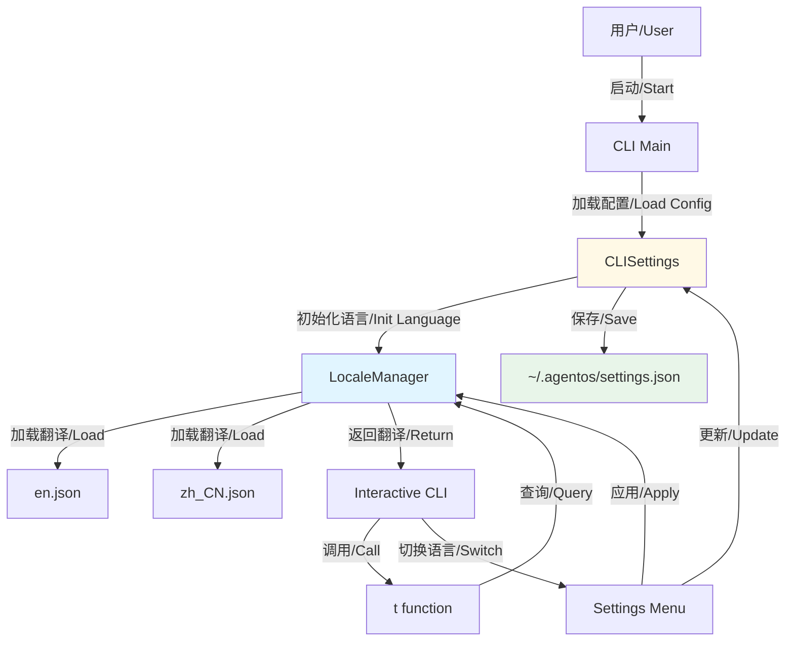
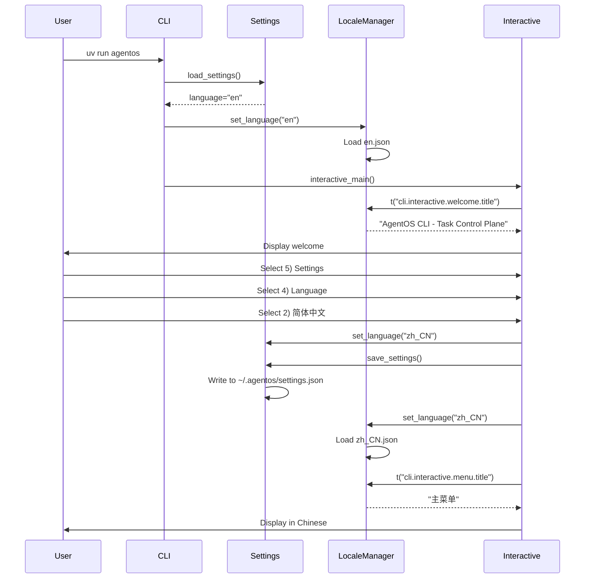
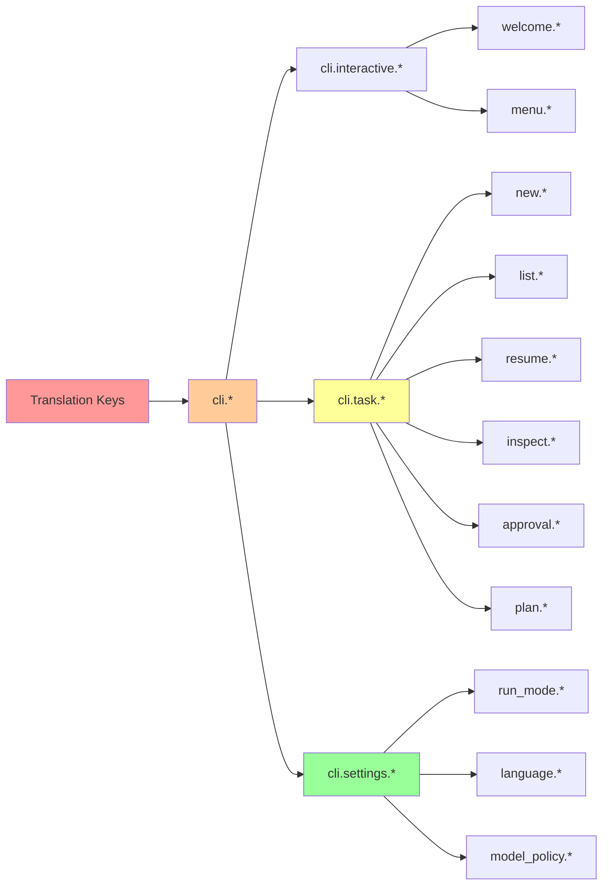

# AgentOS i18n 架构图

## 系统架构



## 数据流



## 文件结构

```
AgentOS/
├── agentos/
│   ├── i18n/                    # 国际化模块
│   │   ├── __init__.py         # 导出 API
│   │   ├── locale_manager.py   # LocaleManager 类
│   │   ├── locales/            # 翻译文件
│   │   │   ├── en.json        # 英语
│   │   │   └── zh_CN.json     # 简体中文
│   │   └── README.md          # i18n 文档
│   │
│   ├── config/
│   │   └── cli_settings.py     # ✨ 添加 language 字段
│   │
│   └── cli/
│       ├── main.py             # ✨ 初始化语言
│       └── interactive.py      # ✨ 使用翻译
│
├── ~/.agentos/
│   └── settings.json           # 配置持久化
│
└── I18N_IMPLEMENTATION_COMPLETE.md  # 实施报告
```

## 翻译键层级



## 关键组件

### LocaleManager

```python
class LocaleManager:
    """单例模式的语言管理器"""
    
    def __init__(self):
        self.current_language = "en"
        self.translations = {}  # {lang: {key: value}}
    
    def translate(self, key: str, **kwargs) -> str:
        """翻译键，支持参数插值"""
        # 1. 查找当前语言
        # 2. 如果没有，回退到英语
        # 3. 插值参数
        # 4. 返回结果
```

### CLISettings

```python
@dataclass
class CLISettings:
    language: str = "en"
    
    def set_language(self, lang: str):
        self.language = lang
```

### 使用示例

```python
from agentos.i18n import t

# 简单使用
print(t("cli.interactive.welcome.title"))

# 带参数
print(t("cli.task.list.found", count=5))
```

---

**实施日期**: 2026-01-26  
**版本**: 1.0  
**状态**: ✅ 已完成
